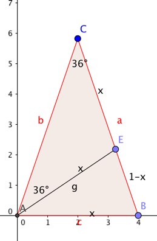

之前看到一篇文章（[见此](https://www.zhihu.com/question/51970177)），其中有说道sin36°的计算。

自己尝试了下，果真不会算。

其实不会算的原因在于没有画好图，而且参考了错误的思路。

<!-- truncate -->

### 下面演示下正确的计算方法：

草稿纸开始作图（如下图）

* 画一个等腰三角形ABC，角C为36°。则角A角B均为72°。（三角形内角180°）
* 画角A的角平分线，相交CB于E点。此时角EAB为36°。角AEB为72°。

通过以上两步，我们发现：

* 我们有了三个等腰三角形。CAB和ECA和ABE。
* 三角形相似，则对应边成比例。（来源于相似三角形公式）

##### 下面，我们开始进行计算。

假设CB长度为1，此时CE=AE=AB为x。EB则为1-x。

相似三角形，底边比斜边相等：

$$\frac{BE}{AB} = \frac{AB}{CB}$$

即：

$$\frac{1-x}{x} = \frac{x}{1}$$

$$x^2 = 1-x$$

对结果进行整理：

$$x^2 +x-1= 0$$

使用求根公式：

$$x=\frac{-b\pm\sqrt{b^2-4ac}}{2a}$$

带入后得到：

$$x=\frac{-1\pm\sqrt{1^2+4}}{2}=\frac{-1\pm\sqrt{5}}{2}$$

在这里，显然是x>0的。所以：

$$x=\frac{-1+\sqrt{5}}{2}$$

##### 好。基本上每条线的长度我们都是已知的了。此时要求sin36°，可以转化为求角CAE的正弦。

我们再做一条辅助线：

* 做E点的垂直线，相交CA于垂足D。

这样就有：

$$sin36^o = \frac{DE}{AE}=\frac{\sqrt{AE^2-AD^2}}{AE}$$

$$sin36^o=\frac{\sqrt{x^2-0.5^2}}{x}$$

$$sin36^o = \frac{\sqrt{(\frac{-1+\sqrt{5}}{2})^2-0.5^2}}{\frac{-1+\sqrt{5}}{2}}$$

$$sin36^o =\frac{\sqrt{(\frac{6-2\sqrt{5}}{4})-\frac{1}{4}}}{\frac{-1+\sqrt{5}}{2}}$$

$$sin36^o =\frac{\sqrt{\frac{5-2\sqrt{5}}{4}}}{\frac{-1+\sqrt{5}}{2}}$$

$$sin36^o =\frac{\frac{1}{2}\sqrt{5-2\sqrt{5}}}{\frac{-1+\sqrt{5}}{2}}$$

$$sin36^o =\frac{\sqrt{5-2\sqrt{5}}}{-1+\sqrt{5}}$$

$$sin36^o =\frac{\sqrt{5-2\sqrt{5}}*\sqrt{(\sqrt{5}+1)^2}}{(\sqrt{5}-1)(\sqrt{5}+1)}$$

$$sin36^o =\frac{\sqrt{5-2\sqrt{5}}*\sqrt{(5+1+2\sqrt{5})}}{4}$$

$$sin36^o =\frac{\sqrt{(5-2\sqrt{5})}*\sqrt{(6+2\sqrt{5})}}{4}$$

$$sin36^o =\frac{\sqrt{10-2\sqrt{5}}}{4}$$

##### 最终检验

> sqrt(10-2*sqrt(5))/4
>
> ans = 0.58779
>
> sin(36/180*pi)
>
> ans = 0.58779

计算正确。

