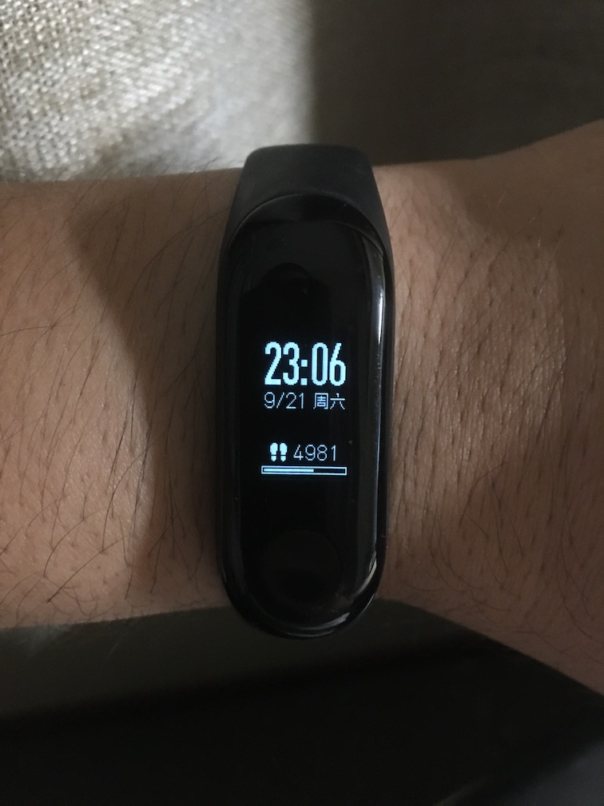
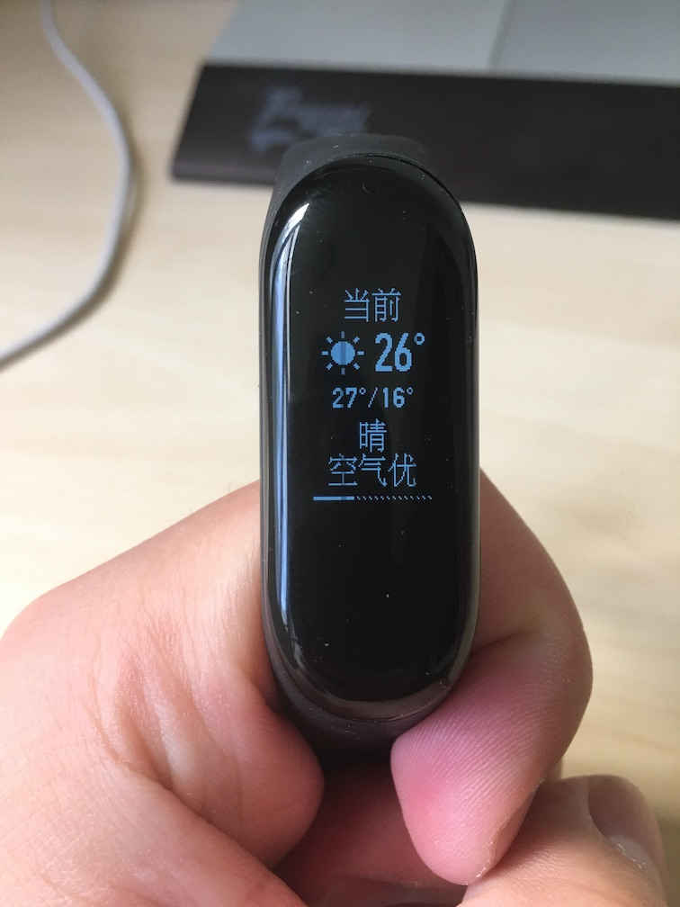
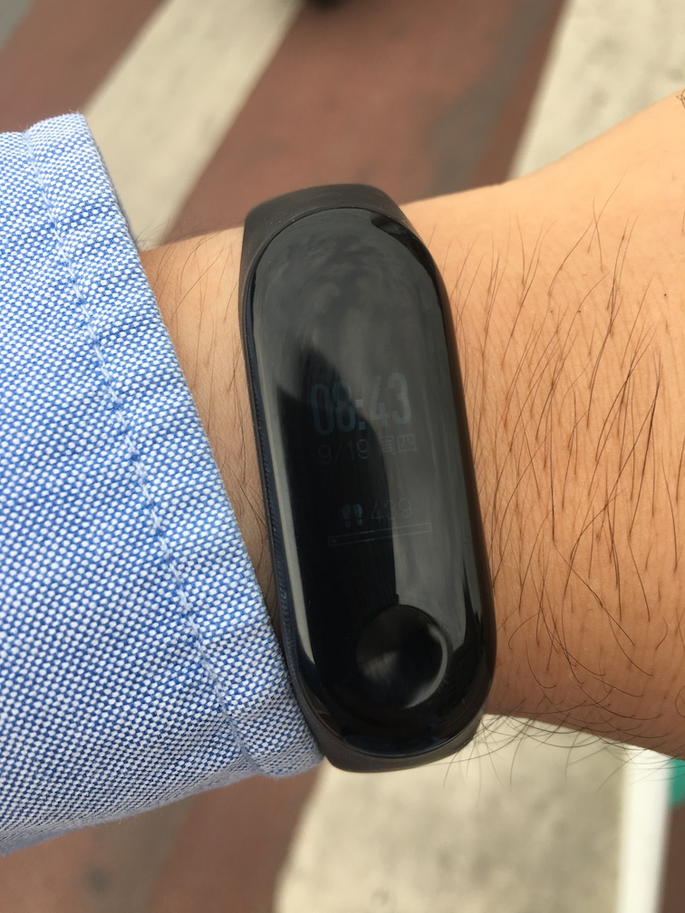

苹果开放第五代手表后，我由于自己过于犹豫，算是第二时间下单了，最普通的 44mm 版本。突然想起来 3 月买的买的小米手环 3，用了已有半年，却还没有做过一次总结。

<!-- truncate -->

我的小米手环 3，是今年 3 月购买，大概 159 元左右。由于我对 NFC 不感冒，而且搭配的是苹果手机，很多 NFC 功能也用不了。最关键的是，购买的时候，NFC 版本也没有发售。

本身我有一块石英表，但我发现它：

* 太重，还是金属表链，特别容易划伤笔记本
* 没办法接收手机通知
* 夜里看不到时间

就想着买一块智能手表。

小米手环比较轻便且便宜，续航也比较久，我就这样选择了。本文从我这半年时间上的经历，来体验评价小米手环 3。由于文章比较匆忙，配图极少。

## 屏幕

刚到手的时候，觉得这块屏幕还是不错的。调整好表盘可以显示时间、日期以及步数，比较实用。虽然可以看到像素颗粒感，但对于一块普通手表，稍微不是太近，也不明显。

虽然只有单色（白色），由于像素想对较大，整体字体布局也比较大和规矩，识别起来还挺容易的。

对于一块 150 块左右的低端手环，在强光下几乎不太可见，所以需要抬高手腕挡住阳关看时间。

上图，是一个天气明朗的早晨，光线不强烈，虽然勉强可见，不过这样的识别度不能让人满意。

## 操作

首先要说抬腕亮屏，识别度不够好，有时候需要刻意用些力气，平缓一些它是感受不到的。即便是能亮屏，速度感觉也不快，可以说不灵敏。

我已经养成了抬腕如果屏幕不亮，直接把手环底部按钮贴到脸颊上，相当于按了一下按键。

不仅如此，滑动操作一样识别不够灵敏，这个问题貌似小米的所有手表手环都类似。表现为你想上下滑动看第二屏的内容，结果明明是向下滑动，结果竟然是向上滑动。

上下滑动由于屏幕高度尚可，体验勉强能算过关。但左右滑动，绝对会让你放弃。

我本以为凹陷的独立按键能体验好一些，不过看样子这个独立按键和滑动用的都是同样的屏幕控制单元吧，有时候一样不灵敏。

总之就是这货的操作，能让你放弃使用它。

## 功能

小米手环 3 提供功能:

* 看时间
* 运动信息
* 天气
* 心率
* 计时器，秒表等
* 启动运动模式
* 通知

其中通知类：

* APP通知提醒（下文详细介绍）
* 来电提醒
* 事件提示
* 久坐提醒
* 手环闹钟

其他功能配置：

* 睡眠监测
* 勿扰模式（没用过）
* 抬腕亮屏
* 夜间模式

#### 看时间

作为一款表的首屏，我认为时间必须看的清晰，而且应该能有一些补充信息。小米手环 3 只能提供步数的首屏展示。不过首屏体验还不错，清晰有致。

#### 运动信息

这里面主要是水平滑动，告诉你步数、消耗热量、运动距离等。此外手表电量也在这里？！好诡异。要不是电量在这个栏目，我估计这个栏目我就移除了，本身运动就很少，再加上这水平滑动体验，还不如手机端查看。

#### 天气

偶尔看下，大部分还是手机上看天气。它可以查看3天的天气，不过需要你手机主动启动 APP，把天气信息传输给手表才行。否则它提示你开启手机 APP 呦。

#### 心率

手表可以自己进入栏目启动心理测试，也可以 APP 内配置好，定时测试。

我运动很少，所以大部分时候不需要心率检测。而且感觉这么便宜的手环，精度应该不是太准，所以绝大部分时间都关闭了，来延长续航时间。

其实也没有那么不准，大概还是可以参考的。开启后续航也能有4天，所以我就把它当做玩具功能吧。

目前开启，除了早晚骑车，偶尔运动，中午吃饭走动心率较高，其他时间相对平稳，我也不知道能有什么作用。

#### 计时器，秒表等

买回来之后用过一次，之后不用了。感觉倒计时可能有用，不过你要接受它的复杂操作。想想还是用手机倒计时或者直接用脑子吧。

#### 通知

**来电提醒**

说白了就是手机来电，手表震动，长按按键拒接。没别的了。有时候手机不在身边，比如找旁边同事沟通，可以不遗漏电话，而且根据来电显示可以判断是否需要立刻返回手机旁边，拿起手机接听。

**事件提示**

需要在 APP 内自己添加，然后到时间了手环会收到提醒，感觉很鸡肋。

**手环闹钟**

我在 APP 设置了清晨闹钟，并关闭了手机自带闹铃，这样就不会打扰他人了。很实用。

**久坐提醒**

大概一小时没有运动亮就会震动提示你以下，对我来说还算好用，因为我不午睡！

不过有时候午睡（下夜班第二天中午还在休息），他判断不出来，结果你睡着了，他震动提示你要运动下...

#### 其他功能配置

**睡眠监测**

睡觉时待着它就行。因为续航长，我几乎除了充电，就没有摘下来过。不论洗澡还是睡觉。第二天可以查看睡眠情况。最明显就是看到几点睡几点起床...其他深度睡眠、浅度睡眠，不知道准不准。

**抬腕亮屏**

我没接触过其他手环之类，所以不知道别的有没有（估计都有吧）。可以设置时间段进行抬腕亮屏，比如夜里抬腕也不亮屏。

**夜间模式**

很实用，就是指定时间内，屏幕变暗。不伤眼睛。夜里带娃，经常喜欢看时间，夜里太亮眼睛却是受不了。

## 通知提醒

当时决定买手环很大的功能需求就是能看到通知。而且不是仅仅告诉我有消息要看，我要看到具体是什么消息内容。

我记得小米米家系列有一款原型石英表，可以蓝牙连接手机，手机有电话、消息时候，它只能震动提醒。这样的手表功能太简单，我仍没办法脱离手机。

小米 APP 里面可以分别设置常用 APP 来消息是否手表通知，不常用 APP 只有一个统一的开关。功能上我认为足够了。

由于受到屏幕分辨率限制，在接收到消息后，屏幕很多时候没办法一屏幕完整显示内容，基本上就是如下：

> 某某某某群：某位人物说：某某某某事情，某某某某事情，某某某某事情

第一屏幕能看到“某群”，“某人”，以及“某某事情”的前几个字...如果想看后续内容，必须要水平滑动屏幕。考虑到上文提到的水平滑动体验，你绝对会放弃查看。

基本上发现是重要的群或者人，你就会自觉使用手机查看。

当然，如果是单人聊天，能显示更多的字，大致是：

> 某某某说：某某某某和某某某某事情

这样基本上能知道要说些什么。可以缓解立即拿起手机查看的情况。

此外，由于是单色屏幕，表情图片啥的，要么显示“口口” 要么显示 “[表情]”之类。虽然低端货不应该要求这么高，但是有时候消息里面回复内容只有表情，没有文字。你必须拿起手机看下，到底是什么表情（是认同还是否定之类）。

**题外话，这货字库很烂。**

刚买到的时候，甚至有的汉字都不能正常显示，很多标点都是乱码 “口口”之类，不过经过几次升级，现在基本上很少遇到乱码了。

## 续航

一直没有买各种智能手表，其中一个关键原因就是各类手表都太费电了，虽然个别安卓阵营的手表能略强于 Apple watch，但是和 iPhone 集成或者功能会有欠缺。

手环不同于手表，功能相对单一且简单，普遍续航都在一周以上。

我大部分时间都是关闭心率检测的，运动也没有开启，主要用消息提醒，每天提醒消息至少有 100 条。基本上小米手环 3 续航在 11-13 天左右，大概就是接近但不到两周。基本上我是每周末冲一次充电。

如果额外有运动模式开启，就相当于启动心率检测了。一周 2-3 次短时间运动，基本上续航超过一周。

最近把自动心率检测和夜间辅助睡眠检测开启，配置了最小间隔（ 1 分钟一次），测试了一轮。大致是四到五天的样子。

如果没必要这么频繁检测，或者和我一样运动时候才开启，手环续航一周应该不难实现。

## 总结

总的来说，小米手环 3 提供了消息提醒的基础解决方案，虽然有很多欠缺，但是也算能提供全面的提醒了。小米手环 4 屏幕升级为彩屏，且分辨率显著提升，这个问题应该基本解决了。

不过屏幕的效果，尤其是强光下差强人意，触摸滑动及按键体验也不够灵敏，建议购买前实际亲自体验下（不论是小米手环 4 还是其他手环）。

续航好像不是问题，因为手环之类都应该没有这种问题。

如果追求较好的体验，可以考虑智能手表，感觉智能手表主要的矛盾在续航，基本上都摆脱不了 1-2 天一次充电的问题。个别手表宣称续航长，比如一个月，基本上也是把智能手表功能砍成手环而已！

有的手表声称一周左右续航，可能很困难，更可能是个别功能需要关闭。

有的手表声称 4 天左右续航，这个倒是可能真的，不过也是要对 GPS 等进行大部分时段关闭。

我觉得只有苹果自己宣称 Apple watch 18 小时续航，才叫真的。这个应该是心率、GPS 等费电的模块都开启，能保证的续航。

具体真实如何，等我的 Apple watch 5 到手后才能揭晓。
