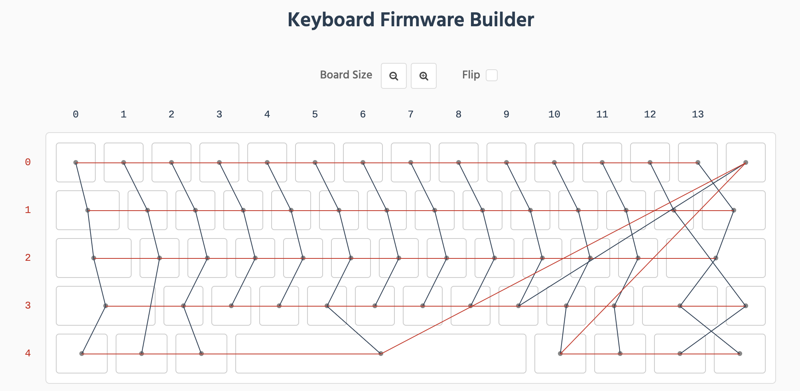
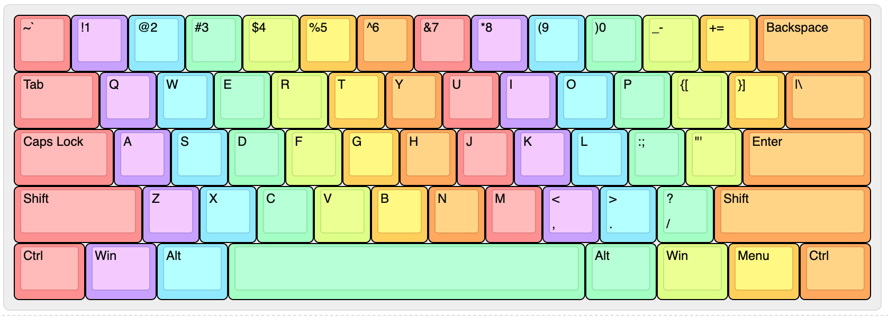

# 主板 PCB

网上有成品 PCB 可以选择。主要在 60% 系列，75%、80% 也有，但很少见，再者就是 Alice 配列。再其他系列我几乎没见到过。

如果买成品 PCB，一般是带有主控的，有的不是开源的固件，可能没办法修改键位等。也有一些支持开源固件，相对可玩性高一些。

键盘还区分单模多模，意思是指支持连接的模式。连接有三种：有线、蓝牙、2.4G。

单模一般指有线连接，注意下接口就好，有的是 Type-C，有的还是老的 Mirco USB。

双模一般是有线，外加蓝牙或者 2.4G，选购时候注意下。

三模就是三种模式都支持。

有线好处是稳定低延时无需供电；蓝牙方式简单快捷但延时稍大；2.4G 延时更低但需要独立接收器。

蓝牙一般电脑带有蓝牙接收器即可直接连接。如果是 2.4G，需要额外接收器。一般常见于两种，公版常规方案，另一种是用罗技的优联方案。

确定好配列，基本上可选择的余地不是太多。所以直接淘宝购买套装即可。

## 自己定制 PCB

如果是自己定制主板，要考虑走线、主控和灯光，难度较大。

一般来讲键盘都是正交矩阵布线，简单来说就是水平、垂直按照行列布线。但是也有一些特殊。如果是自己定制主板，建议选择引脚多的主控，这样可以尽可能使用标准布线。如果引脚实在不够，也可以多行、多列用一个引脚。



GH60 Satan 的布线（图片由 [Keyboard Firmware Builder](https://kbfirmware.com) 生成）。

它是一个 14x5 的矩阵。需要主控芯片 14+5 = 19 个引脚。

不过对于一般爱好者而言，不会设计这么复杂，除非真的是主控芯片引脚不够。

比如要做一个 GH60 标准配列下图键盘（列方向按颜色区分），14 列、5 行。也是 19个引脚。



GH60
我设计的布线。图片由 [KLE](http://www.keyboard-layout-editor.com/##@@_c=%23ff9191&t=%23000%3B&=~`&_c=%23c8a1ff&t=%23000000%3B&=!1&_c=%2391e9ff%3B&=%2F@2&_c=%23a3ffc3%3B&=%233&_c=%23deff87%3B&=$4&_c=%23ffcf5c%3B&=%255&_c=%23ffa85e%3B&=^6&_c=%23ff9191%3B&=%2F&7&_c=%23c8a1ff%3B&=*8&_c=%2391e9ff%3B&=(9&_c=%23a3ffc3%3B&=)0&_c=%23deff87%3B&=%2F_-&_c=%23ffcf5c%3B&=+%2F=&_c=%23ffa85e&w:2%3B&=Backspace%3B&@_c=%23ff9191&w:1.5%3B&=Tab&_c=%23c8a1ff%3B&=Q&_c=%2391e9ff%3B&=W&_c=%23a3ffc3%3B&=E&_c=%23deff87%3B&=R&_c=%23ffcf5c%3B&=T&_c=%23ffa85e%3B&=Y&_c=%23ff9191%3B&=U&_c=%23c8a1ff%3B&=I&_c=%2391e9ff%3B&=O&_c=%23a3ffc3%3B&=P&_c=%23deff87%3B&={[&_c=%23ffcf5c%3B&=}]&_c=%23ffa85e&w:1.5%3B&=|\%3B&@_c=%23ff9191&w:1.75%3B&=Caps)
生成。

如果你希望增加按键，那么可以把空余的垂直列进行特殊走线处理。就类似上面 GH60 Satan 了。

来看下我在用的 KeyChron Q5 的键盘情况。源码位置参考[这里](https://github.com/Keychron/qmk_firmware/blob/master/keyboards/keychron/q5/config.h)。

```c
/* Key matrix size */
#define MATRIX_ROWS 6
#define MATRIX_COLS 18

/* Key matrix pins */
#define MATRIX_ROW_PINS \
    { B5, B4, B3, A15, A14, A13 }
#define MATRIX_COL_PINS \
    { A10, A9, A8, B1, B0, A7, A6, A5, A4, A3, NO_PIN, NO_PIN, NO_PIN, NO_PIN, NO_PIN, NO_PIN, NO_PIN, NO_PIN }
```

我们可以看到，它是 18 列、6 行的配置。所以需要 18+6 = 24 个引脚（不用关心里面的 `NO_PIN`）。

主控的话，有线版常见用 Pro Micro 板（ATmega32U4 主控），Teensy 2.0（ATmega32U4 主控），当然也有其他的。不同的主控，可以刷的固件也不太一样。蓝牙版我没接触过，不太好说，但大部分使用了 nrf52840 主控。

灯光上，如果需要，可以考虑在主板上留位置。以便后续开发固件接入。灯光一般分为按键灯和背景灯，常见的是按键灯。灯还区分为普通单色灯和 RGB 多色灯。

也有一些爱好者在嘉立创（电路板设计及打印等一体化平台，每月可以免费打印迷你电路板几个）或者键盘等社区社群，提供设计好的主板。这种我建议还是慎重入手，因为外壳、主板等需要配套，单独主板绝大部分人都没办法和外壳匹配。如果有成品键盘（一般会非常贵），倒是可以考虑。

此外，一般都会在每个轴体上加装开关二极管，主要为了多键防冲。具体原因，可以参考这篇文章<sup>[[1]](#参考)</sup>了解。如果制作简单的小键盘等，也可以不加入二极管，我个人理解两个按键同时按，是没问题的。二极管解决的事超过两个按键的问题。而且也可以像薄膜键盘一样，通过改变布线方式来缓解冲突问题。

## 参考

[1]&nbsp;[How a Keyboard Matrix Works](https://docs.qmk.fm/#/zh-cn/how_a_matrix_works)
